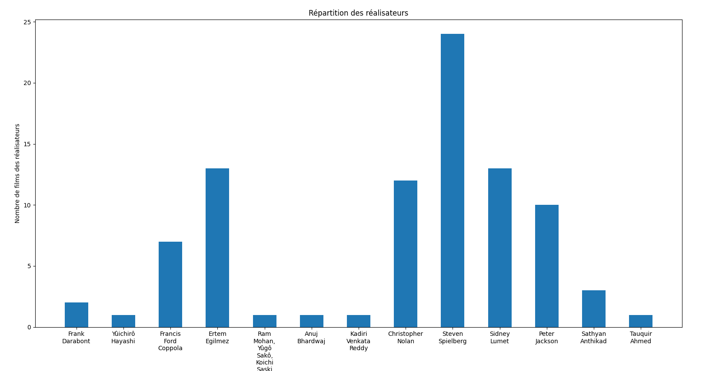

# Mini Projet BDD

## Introduction
Ce projet a pour objectif d'explorer les données cinématographiques issues de l'IMDb afin d'analyser les relations entre les budgets de production et les notes des films. Nous examinons également la distribution des films et des réalisateurs qui ont produit des œuvres très bien notées. le but est d'essayer de trouver une utilité métier pour conseiller des producteurs sur le choix du réalisateur

## DataSet utilisé
**IMDB_Movies_Dataset** via [Kaggle.com](https://kaggle.com)

## Choix des données 

- Average Rating : La note moyenne sur IMDb
- Metascore : Le score critique provenant de Metacritic
- Title : Le titre du film
- Director : Les réalisateurs
- Writer : Les scénaristes
- Release Date : La date de sortie
- Country Of Origin : Le pays d'origine
- Budget : Le budget de production
- Runtime : La durée du film

**Source** : Internet Movie DataBase (IMDb)

**Caractéristiques** : 

- La note moyennes : c'est la moyenne des notes données par les utilisateurs d'IMDb au film, c'est un indicateur de la popularité critique de l'oeuvre

- Metascore : Le metascore issue du site metacritic

- Le titre : le titre anglais du film

- Le réalisateur : Le nom et prénom du réalisteur du film, si plusieur réalisateurs (ex : Matrix), les données sont entre parenthèses

- Scénariste : La liste (entre parenthèse) des personnes crédité au scénario pour le films

**Quelles données gardons nous pour l'analyse ?**
- Average_rating
- Director
- Budget
Le but sera d'analyser les relations entre les budgets de production et les notes des films en fonction des réalisateurs

## Visualisation
- On met en place un BAR Chart pour visualiser les données, on affiche le nombre des films des réalisateurs qui ont eu au moins un average rating sur un de leurs films > 9 

- Une relation entre les budgets et les réalisateurs
Un Bar Chart montre la somme des budgets des films pour chaque réalisateur ayant au moins un film bien noté (Average Rating ≥ 9). Les budgets ont été convertis en dollars pour permettre une analyse cohérente

## Problématique
Est ce que le budget possède une influence sur la note d'un film en fonction du réalisateur ?

## Mise en place d'un décisionnel

### Mise en place d'une regression linéaire Générale sur tous les réalisateurs

### Mise en place d'une regression linéaire ciblés sur ceux qui

